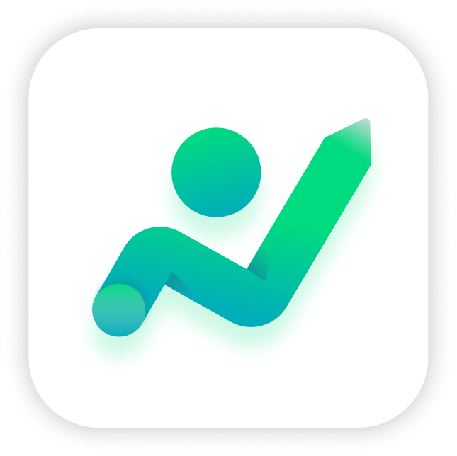
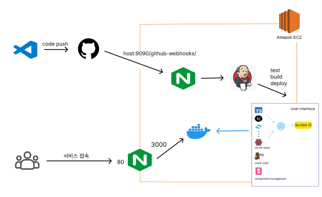

# 런:US Front




<br/>

## 서비스 소개
- URL : https://run-us.netlify.app/
- 공부러를 위한 스터디그룹 목표 달성 보조 서비스. 런:US는 스터디 그룹 목표를 달성할 수 있도록 돕는 보조 서비스로, 팀원들끼리 서로 문제집을 생성하고 풀면서 매번 목표를 인식하게 다시금 도와줍니다.
- Keyword : `#서로에게 내는 문제집` `#다함께 목표 달성` `#나의 공부 기록`


## 실행
```
npm run dev
```
<br/>

## Front-end Developer
 
<table border="1">
    <th>
        <a href="https://github.com/jeongye01">정예원</a>
    </th>
    <th>
        <a href="https://github.com/ShinJongUng">차주희</a>
    </th>
    <tr>
        <td>
            
        </td>
        <td>
            
        </td>
    </tr>
</table>

<br/>

## Skill Set
- typescript - language
- nextjs - react framework
- zustand - client 상태 관리
- react-query - server 상태 관리
- tailwindCSS -  css framwork
- jenkins & docker - ci/cd (현재 버전에선 Netlify로 대체)
- storybook - ui 문서화

## Architecture



